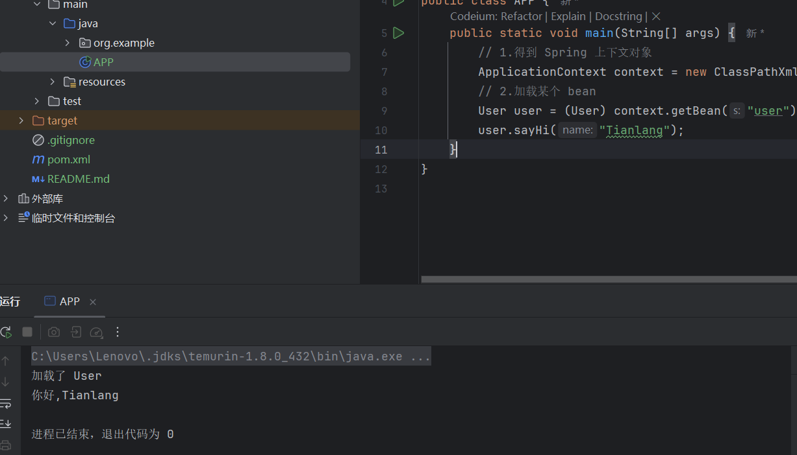

# Spring-Springboot学习

*Date in 2024/12/23  Made by Tianlang 部分参考于网络        **声明：仅个人学习使用！***

# Spring的设计思想与使用

## 1、Spring的基本概念

​			通常所说的 Spring 指的是 **Spring Framework（Spring 框架）**，它是⼀个开源框架，有着活跃⽽庞⼤的社区，Spring ⽀持⼴泛的应⽤场景，它可以让 Java 企业级应⽤程序**开发起来更简单**。
而Spring的本质其实就是是包含了众多⼯具⽅法的 IoC 容器。

<u>这里我们有两个关键字，一个是IoC ，另一个则是容器。</u>

#### **1.容器⽤来容纳某种物品的（基本）装置。**

​	比如我们Java中常用的List/Map就是一种数据存储容器

#### **2.IoC类型**

​	前面我们提到Spring是一个IoC容器，而IoC（Inversion of Control 翻译成中⽂是“控制反转”的意思）

#### 3. Spring 最核心的功能，**就是学如何将对象存⼊到 Spring 中，再从 Spring 中获取对象的过程**

​	对象存储在 IoC 容器相当于将以后可能⽤的所有⼯具制作好都放到**仓库**中，**需要的时候直接取就⾏了，⽤完再把它放回到仓库。**⽽ new 对象的⽅式相当于，每次需要⼯具了，才现做，⽤完就扔掉了也不会保存，下次再⽤的时候还得重新做，这就是 IoC 容器和普通程序开发的区别

## 2、Spring的IoC设计思想

Spring 是⼀个 IoC（控制反转）容器，重点还在**容器**⼆字上.它具备两个最基础的功能：

- 将对象**存⼊**到容器；

- 从容器中**取出**对象

Spring 是⼀个 IoC 容器，说的是**对象的创建和销毁的权利都交给 Spring 来管理了，它本身⼜具备了存储对象和获取对象的能⼒**

### 1.IoC设计与普通设计对比


​					通⽤程序的实现代码，类的创建顺序是反的，传统代码是 Car 控制并创建了 Framework，Framework 创建并创建了 Bottom，依次往下，⽽改进之后的控制权发⽣的反转，**不再是上级对象创建并控制下级对象了，⽽是下级对象把注⼊将当前对象中，下级的控制权不再由上级类控制了**，这样即使下级类发⽣任何改变，当前类都是不受影响的，这就是典型的控制反转，也就是 IoC 的实现思想

### 2.代码实例

​		这里先用常上层依赖下层的方法构造一个对象-人，通过下述代码易得的：我先创建了一个People类，传入了体重参数70，使用run函数驱动之。在构造的People类中init函数驱动下层的初始化，在这之前的构造函数中，又将下层通过新建类对象的方法创建之。

```java
public class Main{
    public static void main(String[] args)
    {
        People Tianlang=new People(70);
        Tianlang.run();
    }
    static class People{
        private Database database;
        public People(int weight){
            database = new Database(weight);
        }
        public void run(){
            database.init();
        }
    }
    static class Database{
        private Weight weight;
        public Database(int TheWeight){
            weight = new Weight(TheWeight);
        }
        public void init(){
            weight.init();
        }
    }
    static class Weight{
        private int weightNum;
        public Weight(int weight){
            this.weightNum=weight;
        }
        public void init(){
            System.out.println("体重是"+weightNum+"千克!\n");
        }
    }
}
```

​		显而易得的，假如Tianlang的健身教练说："我要Tianlang体重两位小数的数据"，即以特定浮点数表示之。这时我们得将Weight->Database->People全部改一遍。于是可得：**当最底层代码改动之后，整个调⽤链上的所有代码都需要修改。**这在实际开发过程中就会严重拖慢我们的进度，下面展示改进方法：

```java
public class Main{
    public static void main(String[] args)
    {
        Weight weight=new Weight(70.15);
        Database database=new Database(weight);
        People people=new People(database);
        people.run();
    }
    static class People{
        private Database database;
        public People(Database database){
            this.database = database;
        }
        public void run(){
            database.init();
        }
    }
    static class Database{
        private Weight weight;
        public Database(Weight weight){
            this.weight=weight;
        }
        public void init(){
            weight.init();
        }
    }
    static class Weight{
        private double weightNum;
        public Weight(double weight){
            this.weightNum=weight;
        }
        public void init(){
            System.out.println("体重是"+weightNum+"千克!\n");
        }
    }
}
```

​			由是可见，我只需要在对应底层Weight修改代码即可，我们先创建了所有的下级依赖类，然后再通过**参数传递的方式注入**。这样我们**不需要在当前类中创建下级类**了，所以下级类即使发⽣变化（创建或减少参数），当前类本身也⽆需修改任何代码，这样就完成了程序的**解耦**。

### 3.DI与IoC

​		所谓依赖注⼊(Dependency Injection)，就是由 IoC 容器在运⾏期间，动态地将某种依赖关系注⼊到对象之中。而依赖注⼊（DI）和控制反转（IoC）只是从不同的角度的描述的同⼀件事情。

​		<u>IoC是一种思想，而DI是实际的落地执行方案。IoC是指导DI去执行的</u>

## 3、Spring的创建与使用

### 1.Spring的创建

有关Spring项目的创建，我们需要使用到maven，类似于我们创建servlet项目。主要分为以下三个步骤：

1. 创建⼀个普通 Maven 项目

   ​		 *Maven是一款服务于Java平台的自动化构建工具。Maven 作为 Java 项目管理工具，它不仅可以用作jar包管理，还有许多的插件，可以支持整个项目的开发、打包、测试及部署等一系列行为*

2. 添加 Spring 框架⽀持（spring-context、spring-beans）。

3. 添加启动类。

详细教程参考https://blog.csdn.net/m0_64338546/article/details/131620968?fromshare=blogdetail&sharetype=blogdetail&sharerId=131620968&sharerefer=PC&sharesource=m0_67168376&sharefrom=from_link

### 2.Spring的使用

**1>存储Bean**
创建Bean对象
将Bean注册到Spring容器中 【spring-config.xml配置文件】
**2>读取Bean**
得到Spring 对象【ApplicationContext】
通过Spring 对象的 getBean() 方法获取到Bean对象 【DI操作】
使用Bean对象 【非必须】

### 3.参照



# 